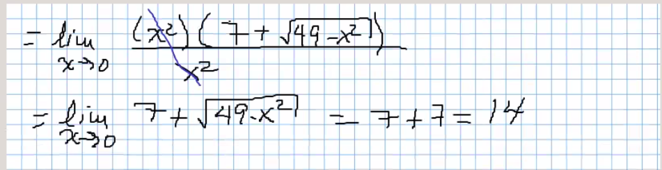

# Repaso Limites

## Definición de limite

Para todo epsilon mayor que cero, existe delta mayor que cero,
 tal que si la diferencia entre x-a esta entre delta, entonces
 la diferencia de la función y su limite es menor que epsilon.

## Ejemplos

1 )

2 )

