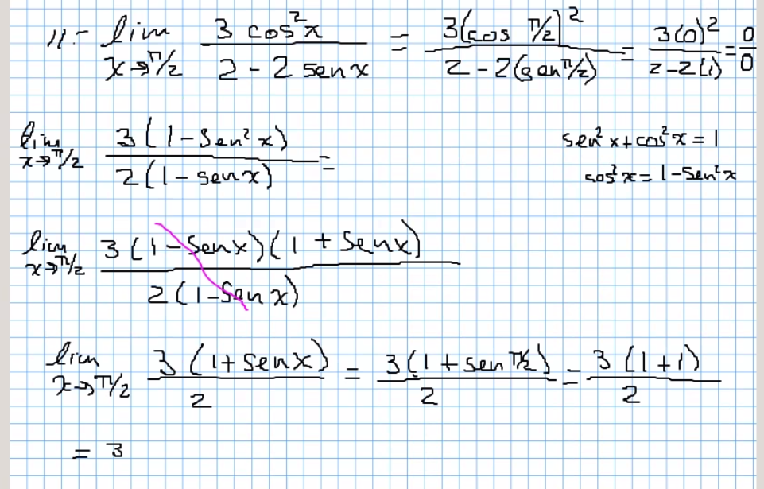
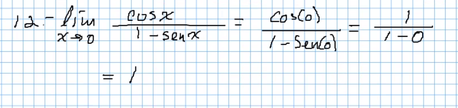
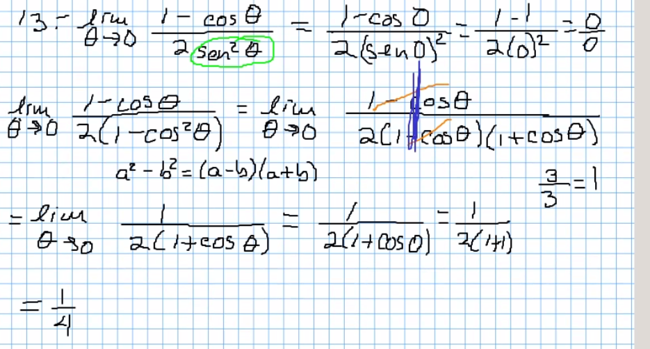
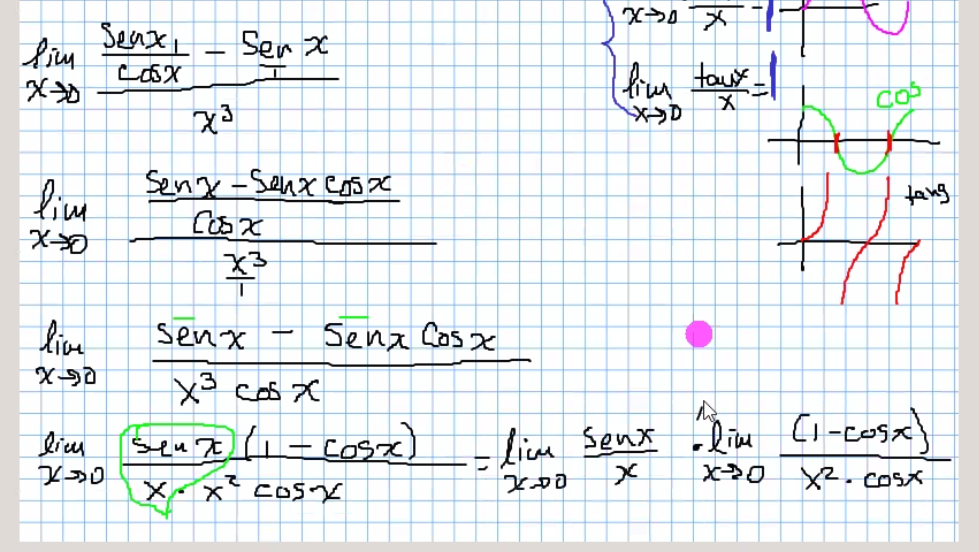
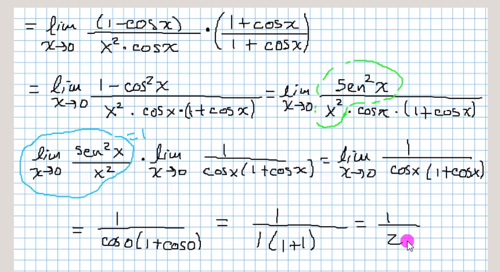
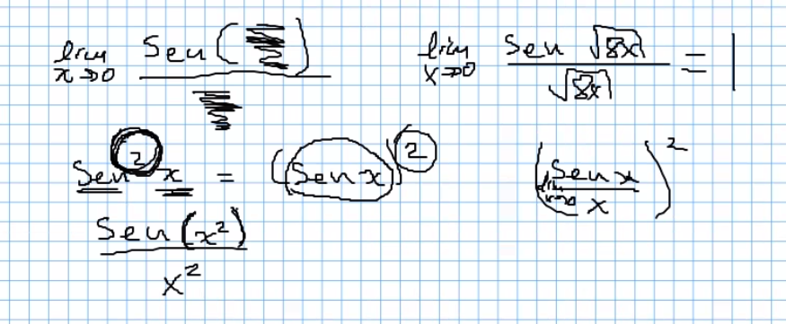

# Limites, :sunglasses: recargado

## Limites repaso

### Ejercicios

Cuando el exponenete esta entre la funcion y la variable
 (seno,coseno,tangente) quiere decir que toda la fución,
 se eleva al exponente, si se aplica al final, solo la
 variable se eleva al exponente

