# Derivada

[Video](https://www.youtube.com/watch?v=pMYdSjgzrys)

## Derivada por los cuatro pasos

### Notaciones para la derivada

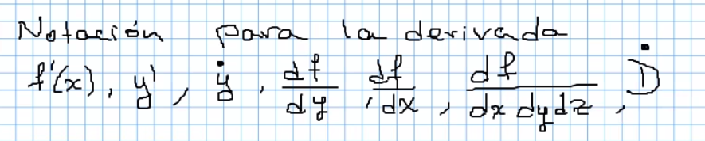

### Ejercicio 1

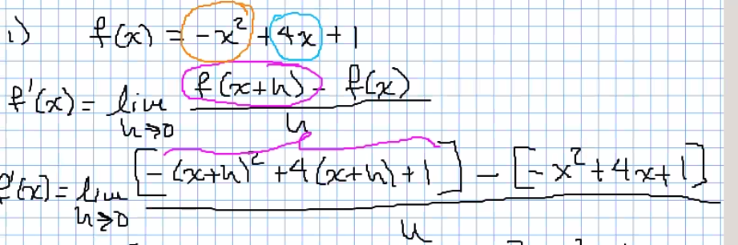
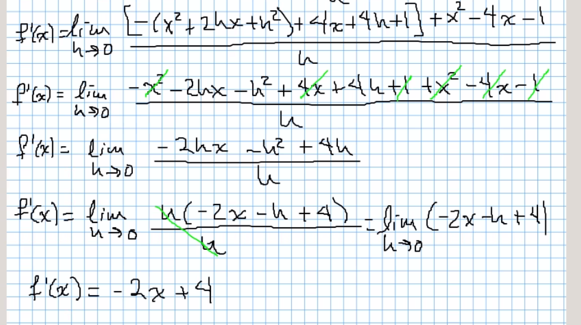

### Ejercicio 2

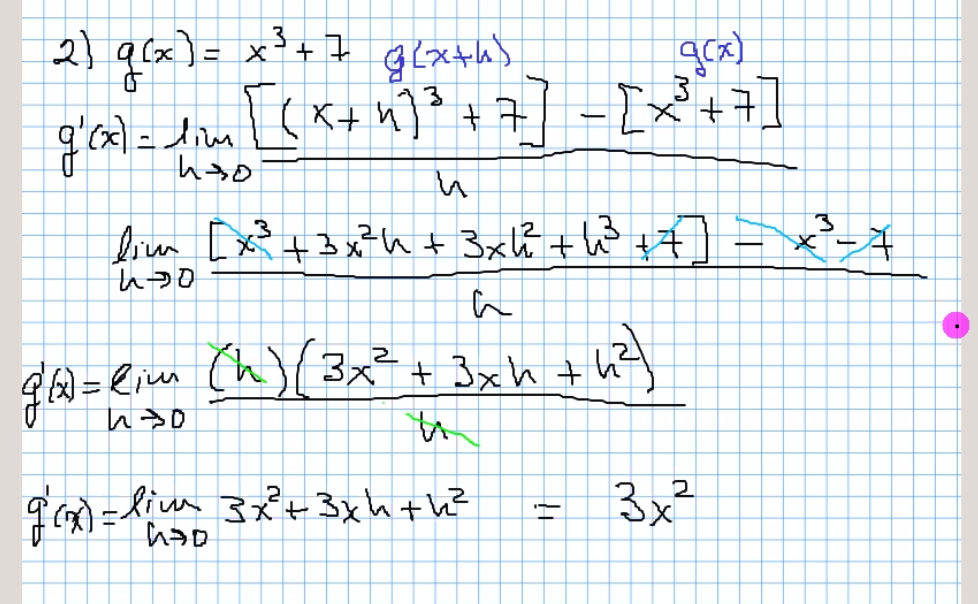

### Regla de derivación

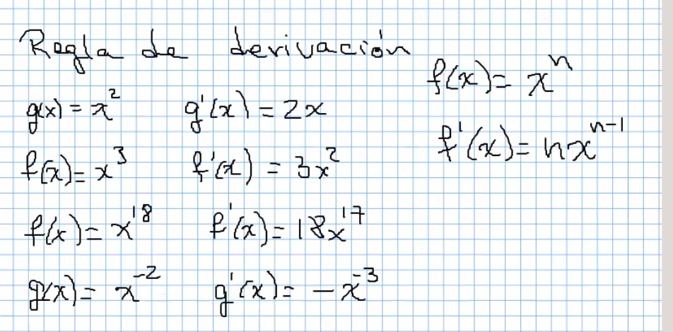

### Ejercicio 3

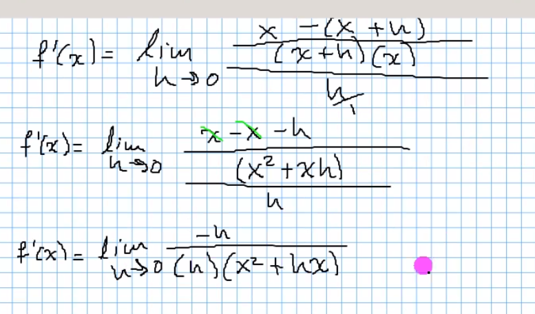
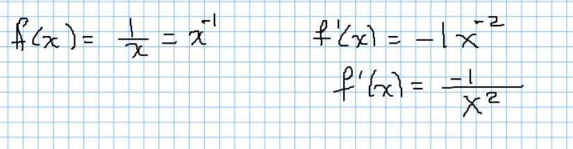

### Ejercicio 4

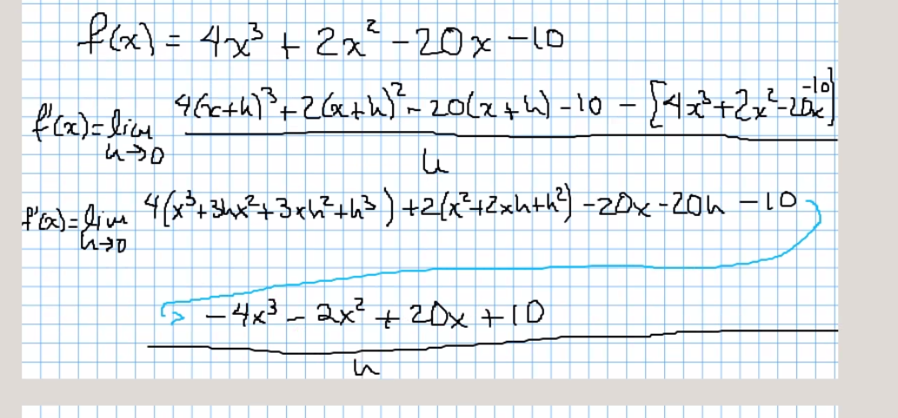
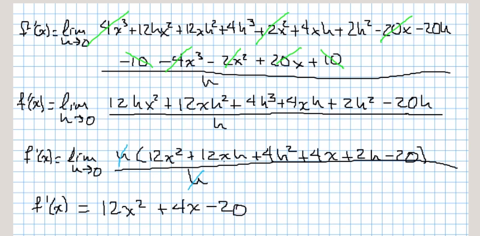

### Regla de derivación 2

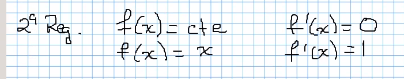

### Ejercicio 5

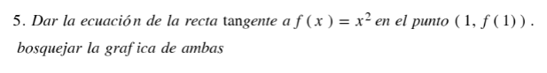
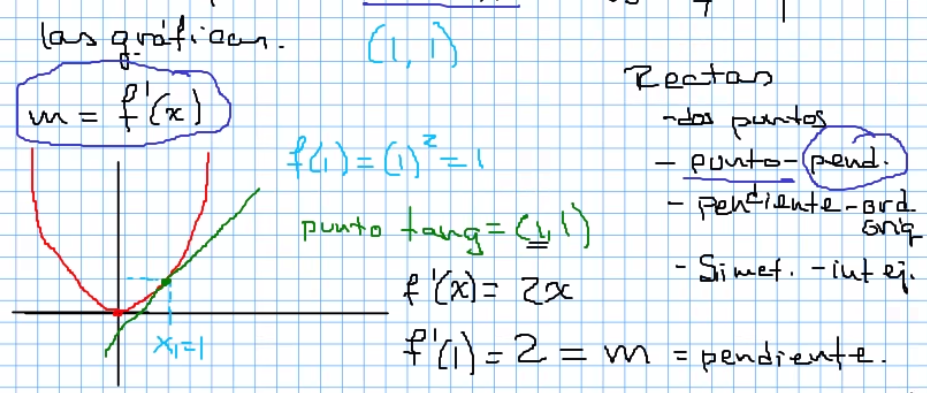
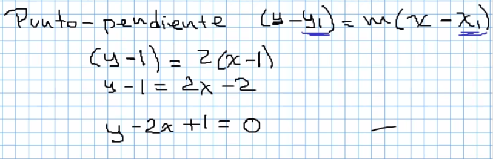
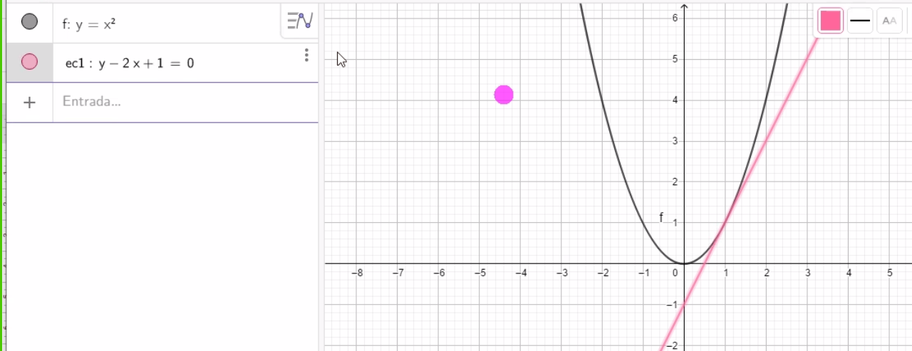
