# Derivada

## Ejercicios de la vida real

### 1

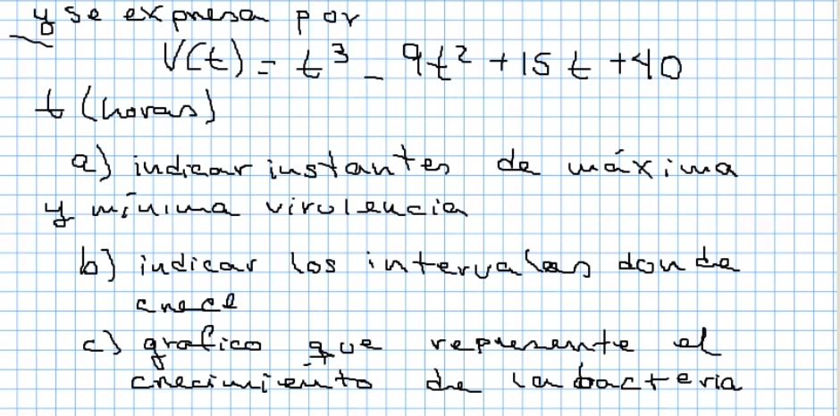
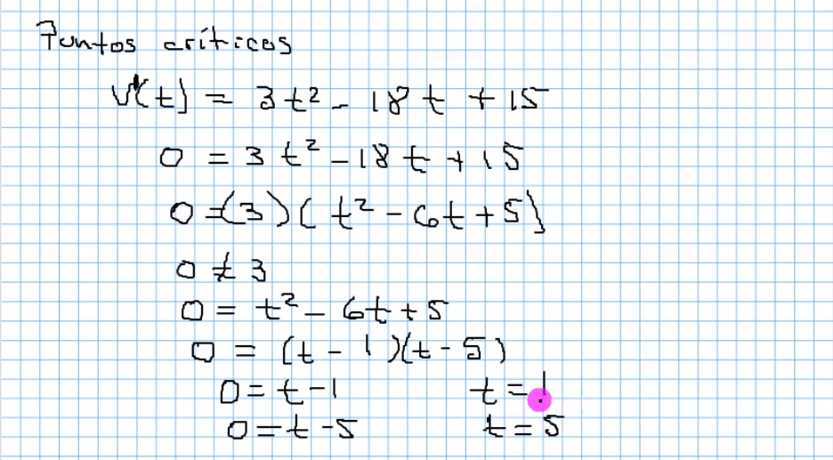
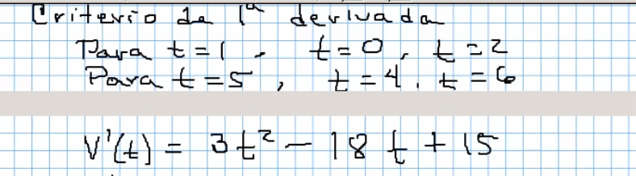
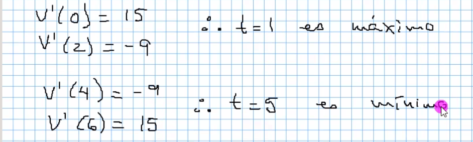

### Continuacion del día anterior

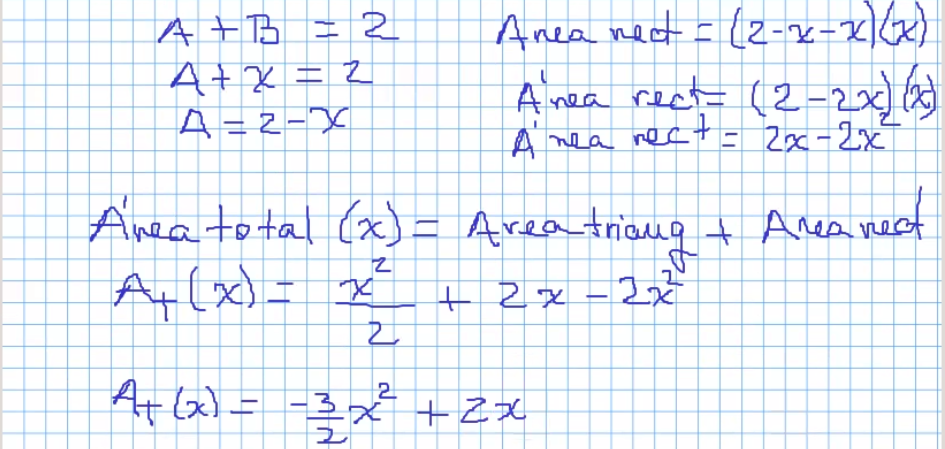
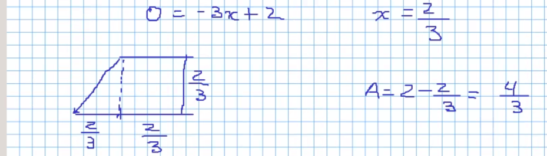

### Ejercicio de la caja

Una caja sin tapa debe tener un volumen 32,000cm³, calcular las
medidas que debe tener para ocupar la menor cantidad de material.

(Las imágenes las tome mal :c unas van repetidas, perdón)

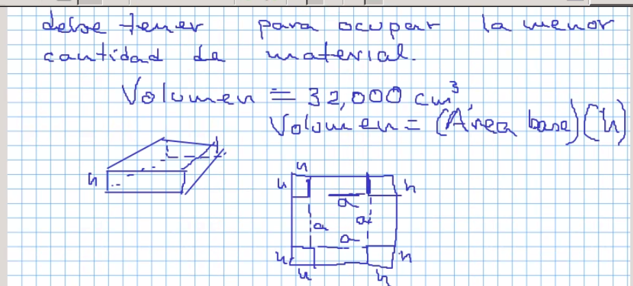
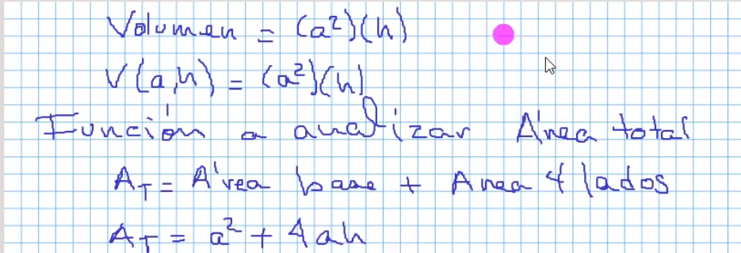
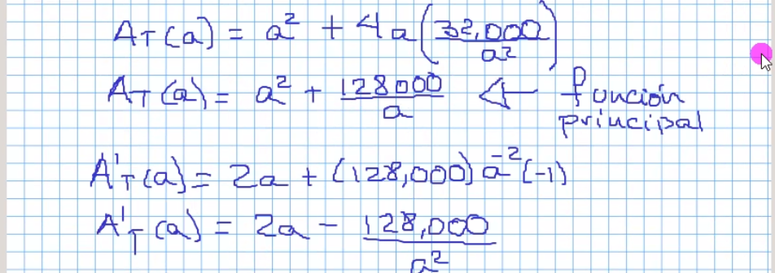
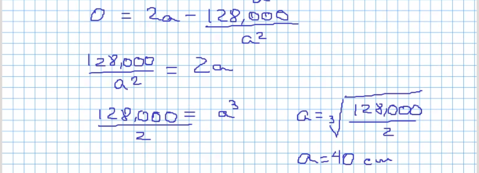
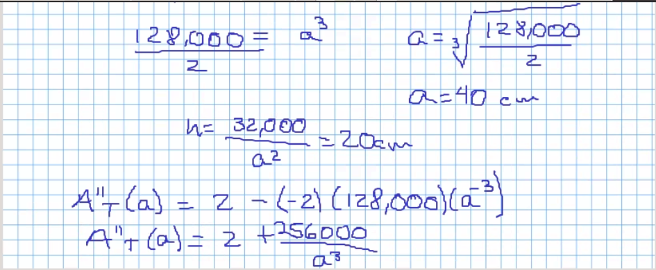
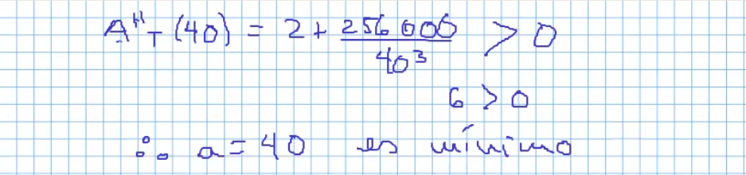
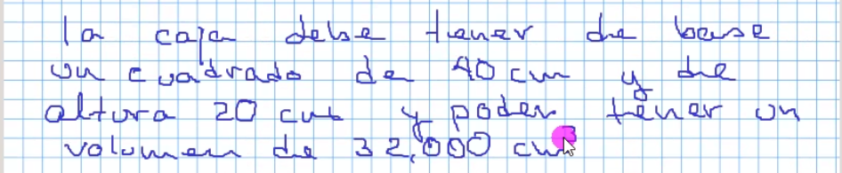

### 3

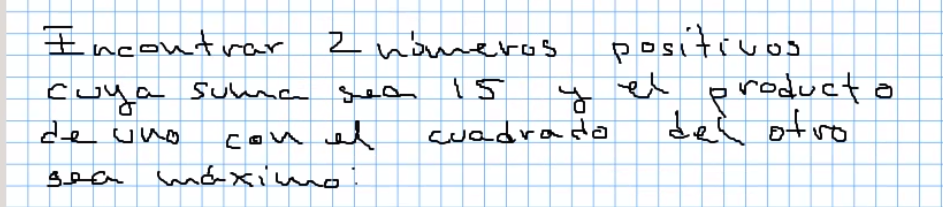
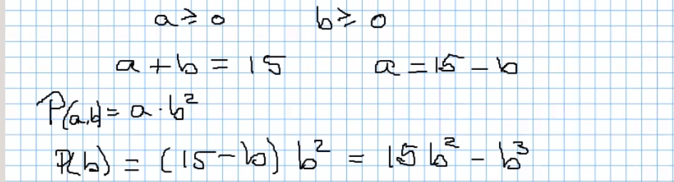

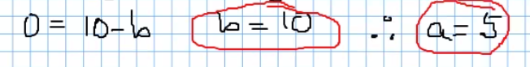
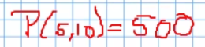
